# 
《网络攻防实战》实验报告

### **CRYPTO & MISC作业**

### 小组成员姓名：金宇航、成浩鹏

### 小组成员学号：181250062、181250020

### 18级软件学院大一班

### 小组成员邮箱：181250062@smail.nju.edu.cn、181250020@smail.nju.edu.cn

### 时间：2019年11月6日

---

## 一、 实验目的

- binwalk
- 010 Editor
- strings
- png、zip

## 二、 实验内容

1. 进击的二进制.gif

   用GIMP打开图片，逐帧看是黑还是白，黑为1，白为0，得到01串，共136位是8的倍数，猜想是17个字符。写如下python代码运行，得到flag`Trinity{g1f4fun!}`

   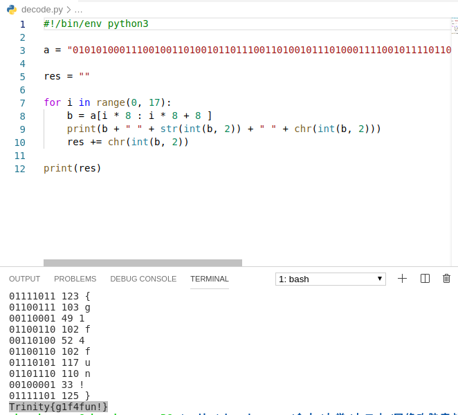

2. multiple.zip

   用`binwalk multiple.zip -e`命令提取出所有文件

   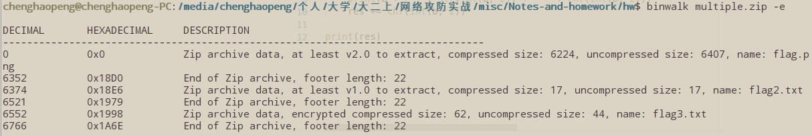

   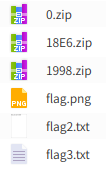

   用010Editor打开flag.png，发现图片的高度和CRC异常

   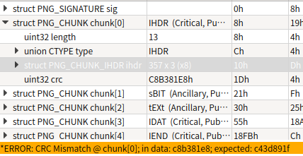

   猜想是高度不对，改高度为100，修改CRC为正确的值，保存，用系统自带看图软件打不开，用Chrome打开看到flag

   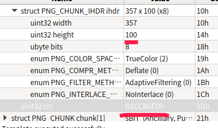

   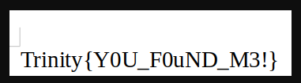

   用`binwalk 1998.zip`发现这个压缩包只有一个flag3.txt，且没有和其他文件杂合，应该就是最后一个flag的文件

   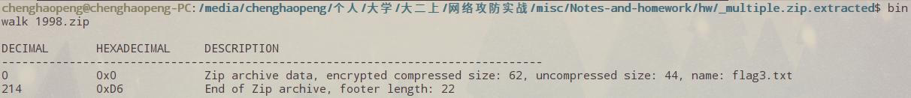

   用010Editor打开，得到flag3.txt未加密时长度为44，加密后为62。通过凑的方式，得到一个原始长度同样为44，加密后同样为62的文本，用任意的密码压缩，得到一个压缩文件fake.zip

   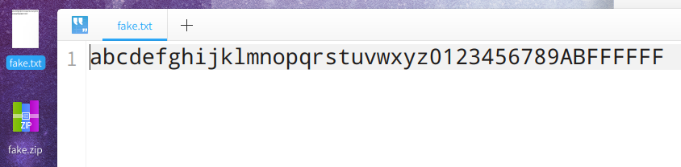

   用010Editor打开1998.zip和fake.zip，对比发现两个压缩文件的内容，除了具体数据、修改时间、外部属性这三部分以外，完全一致，说明1998.zip确实是加密过的

   **1998.zip文件信息**

   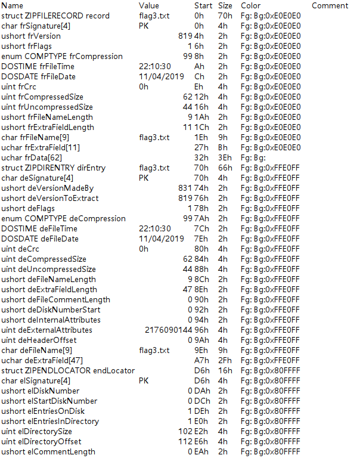

   **fake.zip文件信息**

   

   尝试了用John和fcrackzip来破解密码，但是很久没有破解出来。就从原始的文件中找信息。用`strings multiple.zip`，看到一个骂人的单词，觉得应该就是密码了

   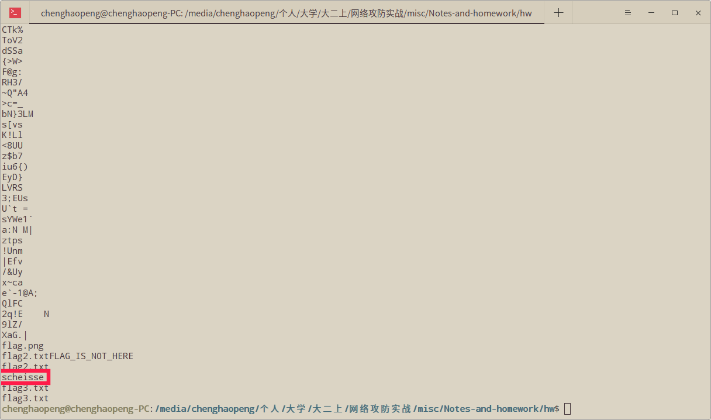

   还真就是了`Trinity{C0ngr4tul4tio0s_Y0u_F0und_1t!!!!!!}`

   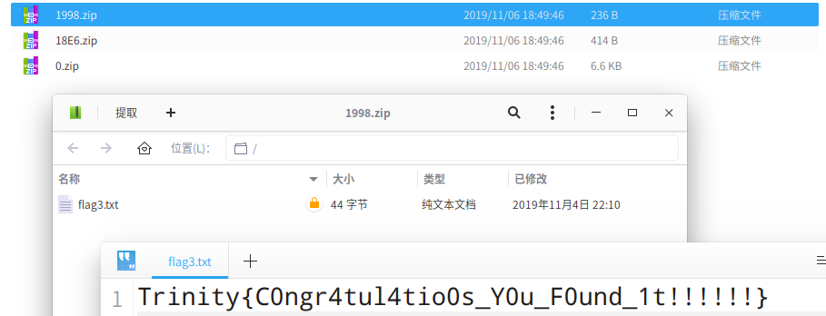

## 三、 实验结果

## 四、 实验中遇到的问题及解决方案

1998.zip的解密一开始一直考虑的是伪加密，但是怎么修改文件头，都不对。直到凑了个文件压缩fake.zip才发现1998.zip是真加密

暴力破解很慢，在得到正确解法之后很长一段时间，都没有破解出来

## 五、 组员分工

未分工

## 六、 实验的启示/意见和建议

---

附：本次实验你总共用了多长时间？包括学习相关知识时间、完成实验内容时间、完成实验报告时间。（仅做统计用，时间长短不影响本次实验的成绩。）

1天