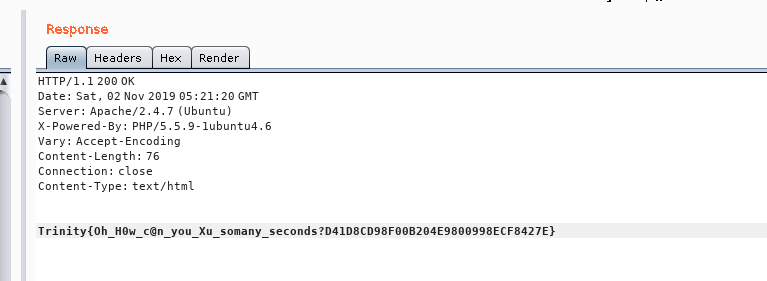

###  第一题
Trinity{Oh_why_@re_u_s0_fast_123654}

[题目地址](http://114.212.190.28:20001)
通过burpsuite拦截请求，如下图

发现hint中.txt文件，访问该文件，得到flag

### 第二题
Trinity{Oh_H0w_c@n_you_Xu_somany_seconds?D41D8CD98F00B204E9800998ECF8427E}

[题目地址](http://114.212.190.28:20002/)
通过检查源代码，查看counter.js文件，得知js文件带cookie发送请求到./getflag.php，于是访问[http://114.212.190.28:200002/getflag.php](http://114.212.190.28:200002/getflag.php)
用burpsuite拦截请求，如下图

结合counter.js，得知需要改cookie中的两个参数，第一个结合counter.js改为True，第二个结合提示改为2222-2-22+23%3A59%3A59，发送得到flag
