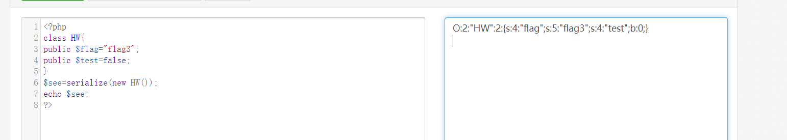

## web2

### hw1
Trinity{Now_you_knw_how_to_set_cooki}

观察给出的PHP代码，需要加入user=flag1的cookie，于是用burpsuite截取请求，添加
`Cookie:user=flag1`的请求，得到flag

### hw2

不会

### hw3
Trinity{serialize_is_ez_if_you_try_locally}

观察给出的PHP代码，需要将HW序列化为字符串作为参数传递，先将HW序列化成字符串：
O:2:"HW":2:{s:4:"flag";s:5:"flag3";s:4:"test";b:0;}

再通过POST请求将字符串作为参数传入:
