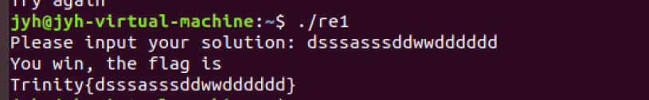
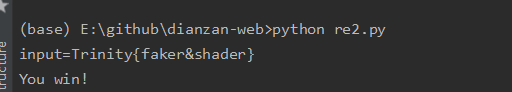

# 逆向作业

### re1
Trinity{dsssasssddwwdddddd}

迷宫问题，获取原数组，根据题目中的算法进行加密，打印路径和墙壁，找到一条从起点到终点的路径

首先，通过python将数组转为int类型
``` python
paMcnE = [5,3,int("FFFFFFF9",16),int("FFFFFFF7",16),int("FFFFFFFD",16),int("FFFFFFFB",16),int("FFFFFFF1",16),int("FFFFFFEF",16),int("FFFFFFF5",16),
          int("FFFFFFF3",16),7,1,0,int("FFFFFFFD",16),int("FFFFFFFC",16),int("FFFFFFFA",16),int("FFFFFFF8",16),int("FFFFFFF6",16),
          int("FFFFFFF4",16),int("FFFFFFF5",16),int("0D",16),2,4,int("FFFFFFFF",16),0,int("FFFFFFFB",16),int("FFFFFFFC",16),int("FFFFFFF7",16),
          int("FFFFFFF8",16),int("FFFFFFF7",16),int("0F",16),5,8,1,4,int("FFFFFFFD",16),0,int("0FFFFFFF9",16),int("FFFFFFFB",16),int("FFFFFFF9",16),int("11",16),
          int("0F",16),4,2,8,7,int("FFFFFFF9",16),int("FFFFFFFB",16),0,int("FFFFFFFB",16),int("0F",16),int("12",16),8,5,int("0B",16),int("0A",16),int("FFFFFFFF",16),
          int("FFFFFFFE",16),3,int("FFFFFFFD",16),int("15",16),int("12",16),int("0D",16),6,int("10",16),int("0A",16),4,int("FFFFFFFE",16),8,1,int("17",16),int("16",16),
          int("0F",16),int("0A",16),int("13",16),int("0D",16),8,1,11,1,int("25",16),int("1E",16),int("1C",16),int("1A",16),9,6,4,3,16,19,int("27",16),int("25",16),
          int("1B",16),int("19",16),int("0F",16),int("0D",16),3,1,int("17",16),int("15",16)]
```

将得到的数组放到C中,根据算法进行加密，并根据规则打印图
```c
#include<stdio.h>

__int64 __fastcall simple_func1(int a1, int a2)
{
	return (unsigned int)(4 * (unsigned int)a2 + a1);
}

__int64 __fastcall simple_func2(int a1, int a2)
{
	return (unsigned int)(-3 * (unsigned int)a2 + a1);
}

__int64 __fastcall simple_func3(int a1, int a2)
{
	return ~((a1 | ~a2) & (a2 | (unsigned int)~a1));
}

__int64 __fastcall simple_func4(int a1, unsigned int a2)
{
	return a1 ^ a2;
}

unsigned int paMcnE[100] = { 5, 3, 4294967289, 4294967287, 4294967293, 4294967291, 4294967281, 4294967279, 4294967285, 4294967283, 7, 1, 0, 4294967293, 4294967292, 4294967290, 4294967288, 4294967286, 4294967284, 4294967285, 13, 2, 4, 4294967295, 0, 4294967291, 4294967292, 4294967287, 4294967288, 4294967287, 15, 5, 8, 1, 4, 4294967293, 0, 4294967289, 4294967291, 4294967289, 17, 15, 4, 2, 8, 7, 4294967289, 4294967291, 0, 4294967291, 15, 18, 8, 5, 11, 10, 4294967295, 4294967294, 3, 4294967293, 21, 18, 13, 6, 16, 10, 4, 4294967294, 8, 1, 23, 22, 15, 10, 19, 13, 8, 1, 11, 1, 37, 30, 28, 26, 9, 6, 4, 3, 16, 19, 39, 37, 27, 25, 15, 13, 3, 1, 23, 21 };

int i, j;

void encode() {
	for (i = 0; i <= 9; ++i)
	{
		for (j = 0; j <= 9; ++j)
		{
			paMcnE[j + 10LL * i] = simple_func1(paMcnE[j + 10LL * i], j);
			paMcnE[j + 10LL * i] = simple_func2(paMcnE[j + 10LL * i], i);
			paMcnE[j + 10LL * i] = simple_func3(paMcnE[j + 10LL * i], 2 * j);
			paMcnE[j + 10LL * i] = simple_func4(paMcnE[j + 10LL * i], i);
		}
	}
}

void print() {
	for (i = 0; i <= 9; ++i)
	{
		for (j = 0; j <= 9; ++j)
		{
			if (paMcnE[j + 10LL * i] == 1 || paMcnE[j + 10LL * i] == 3 || paMcnE[j + 10LL * i] == 4 || paMcnE[j + 10LL * i] == 5) {
				printf("#");
			}
			else if (i == 2 && j == 1) {
				printf("S");
			}
			else if (paMcnE[j + 10LL * i] == 7) {
				printf("G");
			}
			else {
				printf(".");
			}
		}
		printf("\n");
	}
}

int main(void) {
	encode();
	print();
}
```

得到如下的图
```
##########
##.#.....#
#S.#.#.#.#
##.#.#.###
##...#.#.#
#..##.#.##
#.#......G
#.#.##.###
#...#..#.#
##########
```

根据走的规则，W A S D，找到路径
dsssasssddwwdddddd，得到flag


### re2
Trinity{faker&shader}

搜索反编译.pyc文件，运用uncompyle6工具，首先安装
`pip install uncompyle6`
接着进行反编译
`uncompyle6 -o re2.py re2.pyc`
用IDLE打开re2.py，得到如下代码：
```python
import base64
inp = bytes((input('input=')), encoding='utf-8')
result1 = base64.b64encode(inp)
result2 = base64.b64encode(result1)
toCheck = b'VkhKcGJtbDBlWHRtWVd0bGNpWnphR0ZrWlhKOQ=='
if result2 == toCheck:
    print('You win!')
else:
    print('Try again!')
```
在python console中进行两次base64.b64decode，得到flag
